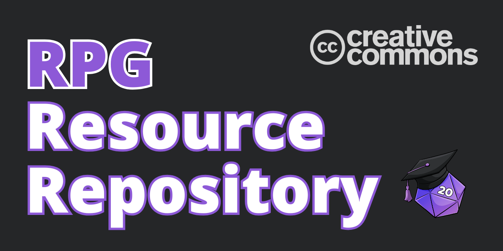
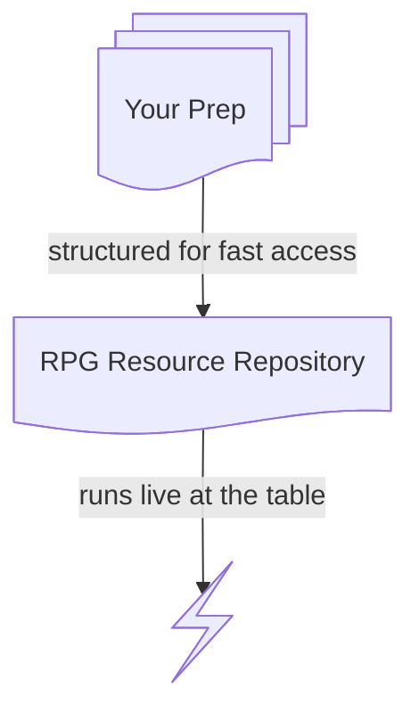

# RPG Resource Repository



A public, version-controlled library of GM content for tabletop RPGs — organized as **backend artifacts** (sources of truth) and **runtime documents** (what you run at the table). Browse it on GitHub or download it as an Obsidian vault.

You are free to use and adapt this repository and the files within. Please include the following attribution:

> This work incorporates material from the [RPG Resource Repository](https://github.com/phd20/rpg-resource-repository) by Kirk Wiebe of [PhD20.com](https://phd20.com/), provided under the [Creative Commons Attribution 4.0 International License](https://creativecommons.org/licenses/by/4.0/).

For more, see [[LICENSE]].

---

## How It Works

Everything here is **free forever** thanks to the support of my wonderful patrons. Over on Patreon, new resources drop regularly. After a few months, some of those resources make their way here for everyone.

> **[Support on Patreon](https://patreon.com/phd20)** to get more artifacts, more quickly.

---

## Start Here: A Full Adventure

**[The Dark Contracts](Adventures/The%20Dark%20Contracts.md)** — A weird, deadly one-shot for Shadowdark RPG characters of levels 1–2. Arthurian legend meets dungeon crawl: Merlin's brain is in a jar, Excalibur is broken, and Arthur dealt with dark powers.

---

## Browse by Category

### Backend — Sources of Truth

| Category | Template | Worked Example |
|----------|----------|----------------|
| NPCs | [NPC Template](Templates/NPC%20Template.md) | [Dredmor](NPCs/Dredmor.md) · [M the Wizard](NPCs/M%20the%20Wizard.md) · [Imp](NPCs/Imp.md) |
| Sites | [Site Template](Templates/Site%20Template.md) | [Dredmor Ruins](Locations/Dredmor%20Ruins.md) |
| Settlements | [Settlement Template](Templates/Settlement%20Template.md) | — |
| Organizations | [Organization Template](Templates/Organization%20Template.md) | — |
| Magic Items | [Magic Item Template](Templates/Magic%20Item%20Template.md) | [Once Upon a Time](Items/Once%20Upon%20a%20Time.md) · [Malice](Items/Malice.md) · [Torment](Items/Torment.md) · [Tireless Weapon](Items/Tireless%20Weapon.md) |
| Items | [Item Template](Templates/Item%20Template.md) | [Drafter's Tools](Items/Drafter's%20Tools.md) |
| Tables | [Table (d6)](Templates/Table%20(d6).md) · [more sizes](Templates/) | [Dark Contracts Tables](Tables/Dark%20Contracts%20Tables.md) · [Books](Tables/Books.md) · [Trinkets](Tables/Trinkets.md) · [more](Tables/) |

### Runtime — What You Run at the Table

| Category | Template | Worked Example |
|----------|----------|----------------|
| Adventures | [Adventure Template](Templates/Adventure%20Template.md) | [The Dark Contracts](Adventures/The%20Dark%20Contracts.md) |
| Encounters | [Encounter Template](Templates/Encounter%20Template.md) | — |

---

## Style Guide

RPG Resource Repository content leans into Markdown as a gold standard.

**Stat blocks and rules-text live in monospace code blocks.**

```
DREDMOR                                                    LV 3
AC 14  HP 9  ATK 2 longsword +3 (1d8)  MV near
S +2  D +1  C +1  I +1  W +0  Ch +2  AL C

Vengeful. Attacks twice with a longsword. The second attack is at disadvantage.
Carries: +1 longsword, chainmail, winged helm (+1 AC)
```

**GM-only content collapses.**

> [!secret]- GM Only — What Happened
>
> The king signed three dark contracts to seal Dredmor — his mortal enemy.
>
> - **Of Spell.** He sacrificed his mage to be imprisoned for eternity.
> - **Of Steel.** He sacrificed the blade that granted him power.
> - **Of Sacrifice.** He sacrificed his love. But on a false altar…
>
> In the end, he sacrificed himself.

**Runtime documents use formatting as permission levels.**

- **Bold** — freely visible, demands attention
- Bullets — discoverable, what the world responds to
- `[!secret]` — hidden, GM-only truth

**[Mermaid diagrams](https://mermaid.js.org/intro/) power visualizations.**



---

## Design Philosophy

The framework behind every piece of content lives in **[PRINCIPLES.md](PRINCIPLES.md)**. The applied version: every principle has a concrete example.

The core model: **Backend** (what is true) → **Runtime** (what you run live). Backend artifacts are standalone sources of truth — an NPC, a location, an item — that can slot into any campaign. Runtime documents orchestrate them at the table.

---

## How to Use This Repo

**Browse.** Read files directly on GitHub. Share links to specific NPCs or locations. Every backend artifact is self-contained and useful on its own.

**Download.** Clone or ZIP and open as an [Obsidian](https://obsidian.md) vault or port the Markdown to your preferred editor.

---

## About PhD20

**PhD20** helps Game Masters run games they're genuinely excited about. I write about worldbuilding, campaign organization, and the tools that support both. I believe that great games come from [GM inspiration connected to meaningful player choice](https://phd20.com/blog/atomic-game-mastery/), not a story written in advance.

### About the Author

👋 I'm Kirk. I've been running D&D since 2010. In 2011, D&D's Chris Perkins selected my dungeon as a finalist in his "Acererak's Apprentice" design contest — which pulled me into the early online D&D community. I went on to run a YouTube channel for five years, back when TTRPG YouTube was a small handful of creators, before Matt Colville and the rise of modern "DungeonTube." These days I write instead, and I'm especially interested in where our hobby meets technology: the tools that help us build and organize worlds, and a healthy skepticism toward the ones that don't.

[phd20.com](https://phd20.com) · [Patreon](https://patreon.com/phd20)

---

<a href="https://github.com/phd20/rpg-resource-repository">RPG Resource Repository</a> © 2026 by <a href="https://phd20.com">Kirk Wiebe</a> is licensed under <a href="https://creativecommons.org/licenses/by/4.0/">CC BY 4.0</a>
