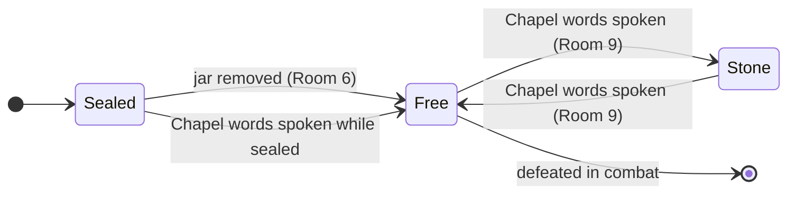

> *Merlin's brain is in a jar. Excalibur is broken. Arthur dealt with dark powers.*

## Introduction

*[TODO: 1–2 sentences describing this as an X adventure for Y level characters, and what a GM needs to know to decide whether to run it.]*

## Prep

- Read: [[Dredmor]], [["M" the Wizard]], [[Imp]], [[Dredmor Ruins]], [[Once Upon a Time]]
- [ ] Decide Dredmor's starting state (default: sealed—jar in Room 6 is intact)

### Background

*[TODO: Write background prose—the history of the king, the contracts, and Dredmor.]*

### Goals

*[TODO: Describe what the player characters want in this adventure.]*

### Obstacles

*[TODO: Describe what stands in the player characters' way.]*

### Seeds

**[[Dark Contracts Tables#Table 1—Rumors & Legends (d6)|Roll or choose rumors]] to plant with players before the session.**

> [!secret]- GM Only—The Truth
>
> A king from a faraway land came to these ruins to seal Dredmor—his mortal enemy. He signed three dark contracts:
>
> - **Of Spell.** He sacrificed his mage to be imprisoned for eternity.
> - **Of Steel.** He sacrificed the blade that granted him power.
> - **Of Sacrifice.** He sacrificed his love—but on a false altar.
>
> In the end, he sacrificed himself.
>
> M doesn't know it was sacrificed. Dredmor doesn't know the king sacrificed himself. The note in Room 11 is the king's last act. The dungeon is full of people who only know part of the story—the party may be the first to know all of it.

## Play

*This section is meant to be used **in play**. The goal is to eliminate or limit the need to reference anything else when running the game. Everything the GM needs should be here with well-structured links to optional or extra information.*

### Procedures & Tracking

**Roll for [[Dark Contracts Tables#Table 2—Random Encounters (d6)|random encounters]] every two rounds.** If play stalls, [[Dark Contracts Tables#Table 3—Chaos (d8)|roll for chaos]].

Unless otherwise noted:
- All doors are **locked**
- All areas are **dark**
- Roll reaction for any monsters unless otherwise noted
- Only demons, devils, and [[Dredmor]] will **pursue** the party if they retreat

**[[Dredmor]]**
- [ ] Freed—jar removed from Room 6
- [ ] Turned to stone—chapel words spoken while free
- [ ] Defeated in combat



**[["M" the Wizard]]**
- [ ] Party took the jar (Dredmor freed)
- [ ] Party told M what happened to it
- [ ] Left behind

**[[Once Upon a Time]]**
- [ ] Pieces recovered from Room 7
- [ ] Reforged
- [ ] Inserted in Room 4 stone—ghost appeared

**The Note**
- [ ] Found in Room 11
- [ ] Party understood what it means

### The Adventure

*Permissions through formatting: **bold** for freely visible, bullets for discoverable, `[!secret]-` for hidden.*

Refer to [[Dredmor Ruins]] for the full room-by-room key.

**The footprints.** Tiny footprints in Room 1 lead toward Room 7. If the party follows them, they find the Imp. If they don't notice them until later, mention them again when the Imp appears. The thread should be there to pull.

- **[["M" the Wizard]]** is in Room 6—not hostile, INT +4, will share everything it knows. The one thing it doesn't know is why it's in the jar.
- **[[Imp]]** is in Room 7 digging for the sword. Make a Reaction Roll at -2. It wants to deal.
- **[[Once Upon a Time]]** pieces are in the rubble in Room 7. Reforging unlocks Room 4.
- **[[Dredmor]]** starts sealed. Removing M's jar frees him. Chapel words (Room 9) toggle stone/free.

> [!secret]- GM Only—The Chapel as Chekhov's Gun
>
> The words "Speak the Dark Contracts. Seal Your Doom." are visible when the party enters Room 9. The phrase "Of Spell, of Steel, of Sacrifice" is carved on artifacts throughout the dungeon—M's jar, the floor of Room 7, the altar in Room 8. By the time the party stands in the chapel with Dredmor free and closing in, they should already know what to say.

> [!secret]- GM Only—M as Information Source
>
> M knows everything about the dungeon and the contracts. It will share—it's not hostile, and it has INT +4. The catch: it doesn't know it was sacrificed. If the party figures out the story and tells M, let that beat happen slowly. It's the most human moment in the dungeon.

> [!secret]- GM Only—The Note Landing
>
> The note in Room 11—*"G—my love, I'm so sorry"*—is easy to gloss over. If the party doesn't engage with it, have M recognize the handwriting, or mention it again when the ghost appears in Room 4. The king sacrificed his love on a false altar and then sacrificed himself. The note is his last act. It should mean something.

### Monster Stats

#### Cultist
```
CULTIST
AC 14 (chainmail + shield), HP 9, ATK 1 longsword +1 (1d8) or 1 spell +2
MV near, S +1, D -1, C +0, I -1, W +2, Ch +0, AL C, LV 2
Fearless: Immune to morale checks.
```

#### Dretch
```
DRETCH (DEMON)
AC 12, HP 11, ATK 1 claw +2 (1d6) or 1 gas
MV near, S +2, D +0, C +2, I -2, W -1, Ch -3, AL C, LV 2
Gas: All in near range DC 12 CON or blinded for 1d4 rounds.
```

#### Giant Bat
```
GIANT BAT
AC 12, HP 9, ATK 1 bite +2 (1d6)
MV near (fly), S -1, D +2, C +0, I -3, W +1, Ch -3, AL N, LV 2
```

#### Skeleton
```
SKELETON
AC 13 (chainmail), HP 11, ATK 1 shortsword +1 (1d6) or 1 shortbow (far) +0 (1d4)
MV near, S +1, D +0, C +2, I -2, W +0, Ch -1, AL C, LV 2
Undead: Immune to morale checks.
```

---

> [!info]
> Head over to [DriveThruRPG](https://www.drivethrurpg.com/en/product/445360/the-dark-contracts) or [Itch.io](https://phd20.itch.io/the-dark-contracts) to get the PDF of this adventure, including the keyed map.

---

*The Dark Contracts, © 2023 PhD20. Designed and written by Kirk Wiebe.*

*"Death is welcome when it comes; but to yield—never!"—King Arthur and His Knights of the Round Table by Roger Lancelyn Green.*

*The Dark Contracts is an independent product published under the Shadowdark RPG Third-Party License and is not affiliated with The Arcane Library, LLC. Shadowdark RPG © 2023 The Arcane Library, LLC.*
