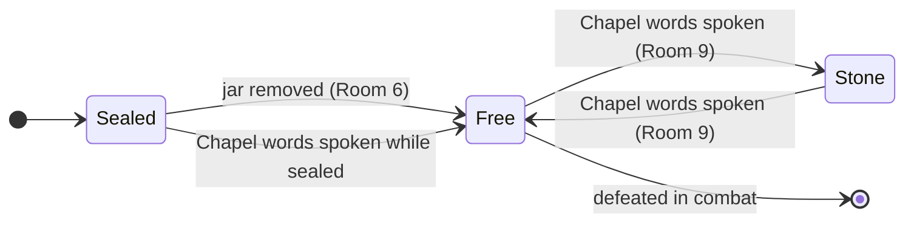

---
categories:
  - adventure
systems:
  - shadowdark
tags:
  - one-shot
  - dungeon-crawl
  - arthurian
---

> *Merlin's brain is in a jar. Excalibur is broken. Arthur dealt with dark powers.*

## Introduction

Welcome to the weird and wild one-shot for Shadowdark RPG characters of levels 1-2. This adventure twists aspects of the Arthurian Legend into a deadly, fantasy dungeon crawl.

## Prep

### Background

A king from a faraway land once came to [[Dredmor Ruins]] to deal with dark powers. It brought him great fortunes but ultimately doom. 

While his story is scattered, his artifacts remain. Rumors of great treasures and magic draw adventurers in. But dangers prove to be too much for most.

> [!secret]- GM Only—The Truth
>
> A king from a faraway land came to these ruins to seal Dredmor—his mortal enemy. He signed three dark contracts:
>
> - **Of Spell.** He sacrificed his mage to be imprisoned for eternity.
> - **Of Steel.** He sacrificed the blade that granted him power.
> - **Of Sacrifice.** He sacrificed his love—but on a false altar.
>
> In the end, he sacrificed himself.
>

### Goals

The likely goal of most parties of adventurers is to obtain treasure.

### Obstacles

Dangerous monsters and the possible consequences of unfolding a dark mystery stand in their way.

### Seeds

> *Seed one or more of these with players before the session begins.*

| d6 | Rumor | True? |
|----|-------|-------|
| 1 | The king guards his sword | False |
| 2 | The king turned into a devil | False |
| 3 | The mage betrayed the king | False |
| 4 | The sword is broken | True |
| 5 | The altar is cursed | True |
| 6 | The mage is alive | True |

## Play

### Procedures & Tracking

Unless otherwise noted:
- All doors are **locked**
- All areas are **dark**
- Roll reaction for any monsters unless otherwise noted
- Only demons, devils, and [[Dredmor]] will **pursue** the party if they retreat

**Roll for [[#Random Encounters]] every two rounds.** If play stalls, roll for [[#Chaos]].

#### Random Encounters

| d6 | Encounter |
|----|-----------|
| 1 | A random NPC wanders in |
| 2 | 1d4 [[The Dark Contracts#Skeleton\|skeletons]] ramble in |
| 3 | An [[Imp]] appears in smoke |
| 4 | A [[The Dark Contracts#Giant Bat\|giant bat]] emerges |
| 5 | A mad [[The Dark Contracts#Cultist\|cultist]] stalks the party |
| 6 | A [[The Dark Contracts#Dretch\|dretch]] (demon) is summoned nearby |
#### Chaos

| d8 | Chaos Event |
|----|-------------|
| 1 | A priest appears and then dies |
| 2 | Voices whisper about a grail |
| 3 | See a vision of a lady in a lake |
| 4 | Silver pieces become white hot |
| 5 | A minor earthquake shakes you |
| 6 | Violent laughter echoes nearby |
| 7 | A swarm of bats overcomes you |
| 8 | Your rations smell of brimstone |
#### Tracking

**Dredmor's Current State**

*Use the checkbox below to track whether Dredmor is sealed or not.*

- [x] Sealed



### The Adventure

*Permissions through formatting: **bold** for freely visible, bullets for discoverable, `[!secret]-` for hidden.*

#### Entrance

> *A **single torch** casts shadows across the walls and down the stone steps. The **air smells of fire and brimstone**.*

- Tiny footprints start here and go down the steps—they belong to the Imp in Room 7
- The torch burns for 1 hour

> [!secret]- GM Only—Secret of the Footprints
> These footprints were left by the imp in the [[Dredmor Ruins#(7) Excalibroken]] room.

#### Pact & Penance

> ***Marble statues** flank the entrance. The western one wields a sword called* ***Pact*** *and points it toward the eastern door. The eastern statue wields* ***Penance*** *and points it toward the western door.*

- Statues are too heavy to move

**Exits:** [[#Entrance]], [[#Empty Room]], [[#Dark Armory]]

#### Empty Room

- Roll for [[#Random Encounters]]
- 2-in-6 chance of finding 2d6 copper pieces

**Exits:** [[#Pact & Penance]], [[#The Stone]]

#### The Stone

> *A **stoic stone** rests at the center of this room. It's a few feet wide and three feet tall.*

- The stone has a small slit on top


> [!secret]- GM Only—Sword in the Stone
> - If [[Once Upon a Time]] is reforged and inserted here, the ghost of the king appears and bestows the **Boon of the Round Table** upon anyone present


**Exits:** [[#Empty Room]], [[#(5) Empty Room]]

#### (5) Empty Room

- Roll for [[#Random Encounters]]
- 2-in-6 chance of finding 2d6 copper pieces

**Exits:** [[#The Stone]], [[#M]], [[#Excalibroken]], [[#Sacrifice]]

#### M

> *A walkway overlooks a 10-foot drop into dark, ominous waters—as still as glass. Three pedestals stand at one end, one with a **curious-looking jar** atop. The **words "Of Spell"** are carved into the jar.*

- Three feet deep; a shield, a dagger, and 1d12 gold pieces rest along the bottom
- A wizard's brain is stored in the jar—fleeting memories of quests with the king; no memory of how it got here


> [!secret]- GM Only—Removing the Jar
> - Removing the jar from the room frees [[Dredmor]]


**Exits:** [[#(5) Empty Room]], [[#The Altar]]

#### Excalibroken

> *The room bears a heavy silence. A **pile of rubble** rests at its center. The **words "Of Steel"** are carved into the floor nearby. A small, **devilish being** dances among the rubble.*

- Once Upon a Time—the broken pieces of the legendary blade are buried in the rubble
- An imp is digging through the pile—make a Reaction Roll with a -2 penalty

```
IMP
AC 13, HP 9, ATK 1 stinger +3 (1d4 + poison)
MV near (fly), S -2, D +3, C +0, I +1, W +0, Ch +2, AL C, LV 2
Impervious: Fire immune.
Contract: Can grant mighty boons and patronage on behalf of an archdevil in exchange for a sworn soul. ADV on related Charisma checks.
```

**Exits:** [[#(5) Empty Room]], [[#The Altar]]

#### The Altar

> ***Black candles** burn on a **bloody altar** behind iron bars. The **words "Of Sacrifice"** are carved into the altar. A **skeleton** lies on it next to a **jeweled dagger and gold crown**.*

- The locked door in the iron bars is **hard** to break open (DC 15)—roll for [[#Random Encounters]] when attempted
- **Jeweled dagger**—embedded emerald worth 120gp
- **Gold crown**—weighs 5 pounds
- The candles burn for 1 hour each if removed from the altar


> [!secret]- GM Only—The Skeleton
> This is the body of the king. It's the true altar he discovered after sacrificing his beloved on a false altar.


**Exits:** [[#Sacrifice]], [[#Chapel]], [[#Excalibroken]], [[#M]]

#### Chapel

> *Two rows of **decrepit pews** lead up to **three small altars**. Words above read, "Speak the Dark Contracts. Seal Your Doom."*

- Speaking "Of Spell, of Steel, of Sacrifice" (in any order) produces one of two outcomes:
  1. If Dredmor is currently free, it will turn him to stone
  2. If Dredmor is currently stone, it will set him free—because magic is fickle.


> [!secret]- GM Only—Dredmor State
> Be sure to update Dredmor's state in the [[#Tracking]] section.


**Exits:** [[#Dark Armory]], [[#The Altar]]

#### Dark Armory

> *Two **black chests** rest against a wall behind iron bars. Two **skeletons** of charred black bone walk around. Blood writing on the wall reads, "What is a soul worth?"*

- The locked door in the iron bars is **hard** to break open (DC 15)—roll for [[#Random Encounters]] when attempted
- The chests are unlocked; contain **[[Malice]]** and **[[Torment]]** along with 2d6 gold pieces
- The skeletons are hostile

**Exits:** [[#Pact & Penance]], [[#Chapel]], [[#Sacrifice]]
#### Sacrifice

> *Three sets of stairs lead down into a vaulted chamber. A central dais rises ten feet from the chamber's floor. A dark altar dominates the northern wall.*

If the Dredmor statue is still here:

> *The stone statue of a warrior stands on the dais with a dragon-winged helm and sword raised in defiance toward the altar.*

**False Altar**

> *Blood covers the obsidian altar. The words, "Of Damnation" are carved into it. A skeleton rests on it near a knife.*

- A note nearby reads: *"G—my love, I'm so sorry."*


> [!secret]- GM Only—What Happened
> The king, in thinking he completed the contracts, sacrificed his beloved on this false altar. His enemy was not sealed. In his grief, he had to sacrifice himself to complete what he set out to do. 

> [!secret]- GM Only—Secrets & Change
>
> **How this place changes:** If Dredmor is freed and then defeated, the dungeon goes quiet in a way it wasn't before. The random encounter frequency drops. The imp leaves. A sense of pressure lifts. The silence is no longer heavy, just the absence of sound.

**Exits:** [[#Dark Armory]], [[#(5) Empty Room]], [[#The Altar]]

### Monster Stats

#### Cultist
```
CULTIST
AC 14 (chainmail + shield), HP 9, ATK 1 longsword +1 (1d8) or 1 spell +2
MV near, S +1, D -1, C +0, I -1, W +2, Ch +0, AL C, LV 2
Fearless: Immune to morale checks.
```

#### Dretch
```
DRETCH (DEMON)
AC 12, HP 11, ATK 1 claw +2 (1d6) or 1 gas
MV near, S +2, D +0, C +2, I -2, W -1, Ch -3, AL C, LV 2
Gas: All in near range DC 12 CON or blinded for 1d4 rounds.
```

#### Giant Bat
```
GIANT BAT
AC 12, HP 9, ATK 1 bite +2 (1d6)
MV near (fly), S -1, D +2, C +0, I -3, W +1, Ch -3, AL N, LV 2
```

#### Skeleton
```
SKELETON
AC 13 (chainmail), HP 11, ATK 1 shortsword +1 (1d6) or 1 shortbow (far) +0 (1d4)
MV near, S +1, D +0, C +2, I -2, W +0, Ch -1, AL C, LV 2
Undead: Immune to morale checks.
```

---

> [!info]
> Head over to [DriveThruRPG](https://www.drivethrurpg.com/en/product/445360/the-dark-contracts) or [Itch.io](https://phd20.itch.io/the-dark-contracts) to get the PDF of this adventure, including the keyed map.

---

*The Dark Contracts, © 2023 PhD20. Designed and written by Kirk Wiebe.*

*"Death is welcome when it comes; but to yield—never!"—King Arthur and His Knights of the Round Table by Roger Lancelyn Green.*

*The Dark Contracts is an independent product published under the Shadowdark RPG Third-Party License and is not affiliated with The Arcane Library, LLC. Shadowdark RPG © 2023 The Arcane Library, LLC.*
