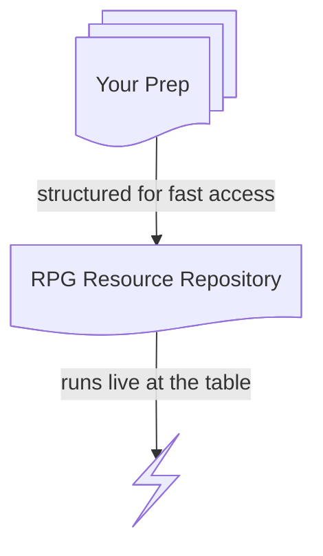

The RPG Resource Repository is a public, version-controlled library of GM content for tabletop RPGs. It's free forever, under Creative Commons. Stop by for inspiration, take artifacts for your games, or download the whole thing as an Obsidian vault.

## 🤍 Support 

Everything here was unlocked from [the Architect's Vault](https://members.phd20.com/)—the Patreon companion where new content starts. Support on Patreon to get everything sooner, plus exclusives that never leave the Vault.

## Creative Commons

This work is licensed under a [Creative Commons Attribution 4.0 International License](https://creativecommons.org/licenses/by/4.0/). Feel free to use this content in any way allowed by the license, provided that you include the following attribution statement in your work:

> This work incorporates material from the RPG Resource Repository by Kirk Wiebe of [PhD20.com](https://phd20.com/), provided under the [Creative Commons Attribution 4.0 International License](https://creativecommons.org/licenses/by/4.0/).

## Human Made Resources

All game material in the RPG Resource Repository is **100% human-made**. Generative AI is **not** used during any part of the creative process to create this material.

## Community

Join a [community](https://forum.phd20.com/) to discuss the repository or any aspect of tabletop roleplaying games.

---

## Getting Started

Much of the organizing approach taken by the RPG Resource Repository was inspired by [this blog post](https://elmc.at/fullstack-refereeing/) about "fullstack refereeing." 

World artifacts are organized into:

- Items
- Locations
- NPCs
- Organizations
- Tables

These notes contain the "what is true" and "how truth changes" about each topic. They are kept atomic—not linking to or depending on any other notes. As written, these types of notes are rarely "ready to run." That's where our "runtime" artifacts come in:

- Adventures
- Encounters

These notes are created and organized in a way to make them easy to run as actual games. They take advantage of Obsidian features and specific styling approaches to help the game master use them at the table. 
### How to Use the RPG Resource Repository

#### Discover and Share Notes

The website generates unique URLs for each note. Like a magic item or NPC? Share the link!

#### Steal Notes

Find a location or encounter for your next session? Copy it to your own notes! The raw Markdown can be found in the [Github repository](https://github.com/phd20/rpg-resource-repository).

#### Download the Entire Vault

The entirety of the content is structured into an Obsidian vault (using wikilinks, callouts, snippets, etc). Download the whole thing as a `.zip` file at the [Github repository](https://github.com/phd20/rpg-resource-repository). Open the `/content` directory as a vault and you're all set.


---

## Design Philosophy

See **[PRINCIPLES.md](PRINCIPLES.md)** and [phd20.com](https://phd20.com) for more on my approach to designing and running TTRPGs.

---
## Properties Guide

```yaml
type: site   # or "settlement" or "item" or "magic-item" or "table" or "npc" or "organization" or "encounter" or "adventure" etc.
system: shadowdark   # or "5e" or "neutral" etc.
tags: dungeon   # additional descriptors for search
```

## Style Guide

RPG Resource Repository content leans into Markdown as a gold standard.

**Stat blocks and rules-text live in monospace code blocks.**

```
DREDMOR                                                    LV 3
AC 14  HP 9  ATK 2 longsword +3 (1d8)  MV near
S +2  D +1  C +1  I +1  W +0  Ch +2  AL C

Vengeful. Attacks twice with a longsword. The second attack is at disadvantage.
Carries: +1 longsword, chainmail, winged helm (+1 AC)
```

**GM-only content collapses.**

> [!secret]- GM Only—What Happened
>
> The king signed three dark contracts to seal Dredmor—his mortal enemy.
>
> - **Of Spell.** He sacrificed his mage to be imprisoned for eternity.
> - **Of Steel.** He sacrificed the blade that granted him power.
> - **Of Sacrifice.** He sacrificed his love. But on a false altar…
>
> In the end, he sacrificed himself.

**Adventures and Encounters use formatting as permission levels.**

- **Bold**—freely visible, demands attention
- Bullets—discoverable, what the world responds to
- `[!secret]`—hidden, GM-only truth or tips

**[Mermaid diagrams](https://mermaid.js.org/intro/) power visualizations where necessary.**



---

## About PhD20

**PhD20** provides tools, resources, and ideas for running better games. I write about worldbuilding, campaign organization, and the tools that support both. I believe that great games come from [GM inspiration connected to meaningful player choice](https://phd20.com/blog/atomic-game-mastery/), not a story written in advance.

### About the Author

👋 I'm Kirk. I've been running D&D since 2010. In 2011, D&D's Chris Perkins selected my dungeon as a finalist in his "Acererak's Apprentice" design contest—which pulled me into the early online D&D community. I went on to run a YouTube channel for five years, back when TTRPG YouTube was a small handful of creators, before Matt Colville and the rise of modern "DungeonTube." These days I write instead, and I'm especially interested in where our hobby meets technology: the tools that help us build and organize worlds, and a healthy skepticism toward the ones that don't.

[phd20.com](https://phd20.com) · [Patreon](https://patreon.com/phd20)

---

<a href="https://github.com/phd20/rpg-resource-repository">RPG Resource Repository</a> © 2026 by <a href="https://phd20.com">Kirk Wiebe</a> is licensed under <a href="https://creativecommons.org/licenses/by/4.0/">CC BY 4.0</a>
